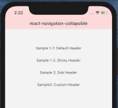

# react-navigation-collapsible

[](https://www.npmjs.com/package/react-navigation-collapsible) [](https://www.npmjs.com/package/react-navigation-collapsible) [](https://github.com/prettier/prettier) [](https://github.com/benevbright/react-navigation-collapsible/actions?query=workflow%3ACI) [](https://expo.io/)

An extension of react-navigation that makes your header collapsible.

Try out the demo on [Expo Snack](https://snack.expo.io/@benevbright/react-navigation-collapsible-v5)

## Compatibility 🚧
📌 In `v5.7.0`, everything has been migrated to use hooks. Please see [a guide for the breaking change](https://github.com/benevbright/react-navigation-collapsible/compare/v5.6.4...v5.7.0#diff-04c6e90faac2675aa89e2176d2eec7d8).

| `react-navigation` | `react-navigation-collapsible` | Documentation                                                                        |
| ------------------ | ------------------------------ | ------------------------------------------------------------------------------------ |
| ≥ v5 (`latest`)    | v5 (`latest`)                  | current                                                                              |
| ≥ v3               | v3                             | [v3-4 branch](https://github.com/benevbright/react-navigation-collapsible/tree/v3-4) |
| v2                 | v2                             | [v2 branch](https://github.com/benevbright/react-navigation-collapsible/tree/v2)     |

🏗 **The Collapsible Tab-navigator** is no longer supported due to the [Android bug from react-native](https://github.com/facebook/react-native/issues/21801).

## Usage

### 1-1. Default Header


```js
// Expo ONLY
import { disableExpoTranslucentStatusBar } from 'react-navigation-collapsible';

/* Call this If you have disabled Expo's default translucent statusBar. */
disableExpoTranslucentStatusBar();
```

```js
import { Animated } from 'react-native';
import { useCollapsibleHeader } from 'react-navigation-collapsible';

const MyScreen = ({ navigation, route }) => {
  const options = {
    headerStyle: { backgroundColor: 'green', height: 150 } /* Optional */,
    collapsedColor: 'red' /* Optional */,
    useNativeDriver: true /* Optional, default: true */,
    elevation: 4 /* Optional */,
  };
  const {
    onScroll /* Event handler */,
    onScrollWithListener /* Event handler creator */,
    containerPaddingTop /* number */,
    scrollIndicatorInsetTop /* number */,
    /* Animated.AnimatedInterpolation by scrolling */
    translateY /* 0.0 ~ -headerHeight */,
    progress /* 0.0 ~ 1.0 */,
    opacity /* 1.0 ~ 0.0 */,
  } = useCollapsibleHeader(options);

  /* in case you want to use your listener
  const listener = ({nativeEvent}) => {
    // I want to do something
  };
  const onScroll = onScrollWithListener(listener);
  */

  return (
    <Animated.FlatList
      onScroll={onScroll}
      contentContainerStyle={{ paddingTop: containerPaddingTop }}
      scrollIndicatorInsets={{ top: scrollIndicatorInsetTop }}
      /* rest of your stuff */
    />
  );
};
```

See [/example/src/DefaultHeaderScreen.tsx](https://github.com/benevbright/react-navigation-collapsible/tree/master/example/src/DefaultHeaderScreen.tsx)

### 1-2. Sticky Header


See [/example/src/StickyHeaderScreen.tsx](https://github.com/benevbright/react-navigation-collapsible/tree/master/example/src/StickyHeaderScreen.tsx)

---

### 2. Sub Header (e.g Search Bar)


```js
import { Animated } from 'react-native';
import {
  useCollapsibleSubHeader,
  CollapsibleSubHeaderAnimator,
} from 'react-navigation-collapsible';

const MySearchBar = () => (
  <View style={{ padding: 15, width: '100%', height: 60 }}>
    <TextInput placeholder="search here" />
  </View>
);

const MyScreen = ({ navigation, route }) => {
  const {
    onScroll /* Event handler */,
    containerPaddingTop /* number */,
    scrollIndicatorInsetTop /* number */,
    translateY,
  } = useCollapsibleSubHeader();

  return (
    <>
      <Animated.FlatList
        onScroll={onScroll}
        contentContainerStyle={{ paddingTop: containerPaddingTop }}
        scrollIndicatorInsets={{ top: scrollIndicatorInsetTop }}
        /* rest of your stuff */
      />
      {/* Wrap your component with `CollapsibleSubHeaderAnimator` */}
      <CollapsibleSubHeaderAnimator translateY={translateY}>
        <MySearchBar />
      </CollapsibleSubHeaderAnimator>
    </>
  );
};
```

See [/example/src/SubHeaderScreen.tsx](https://github.com/benevbright/react-navigation-collapsible/tree/master/example/src/SubHeaderScreen.tsx)

### 3. Custom Header



```js
import { Animated } from 'react-native';
import { useCollapsibleHeader } from 'react-navigation-collapsible';

const MyScreen = ({ navigation, route }) => {
  const options = {
    /* Add a custom header to 'useCollapsibleHeader' options the same way you would add it to the Stack.Screen options */
    customHeader: ({ scene, previous, navigation }) => {
      const { options } = scene.descriptor;
      const title =
        options.headerTitle !== undefined
          ? options.headerTitle
          : options.title !== undefined
          ? options.title
          : scene.route.name;

      return (
        <MyHeader
          title={title}
          leftButton={
            previous ? <MyBackButton onPress={navigation.goBack} /> : undefined
          }
          style={options.headerStyle}
        />
      );
    },
  };
  const {
    onScroll /* Event handler */,
    containerPaddingTop /* number */,
    scrollIndicatorInsetTop /* number */,
  } = useCollapsibleHeader(options);

  return (
    <Animated.FlatList
      onScroll={onScroll}
      contentContainerStyle={{ paddingTop: containerPaddingTop }}
      scrollIndicatorInsets={{ top: scrollIndicatorInsetTop }}
      /* rest of your stuff */
    />
  );
};
```

See [/example/src/CustomHeaderScreen.tsx](example/src/CustomHeaderScreen.tsx)

`react-navigation` recommends to use `headerMode='screen'` when you use the custom header. [[Set headerMode to screen]](https://reactnavigation.org/docs/stack-navigator/#set-headermode-to-screen)

## Install

```bash
# install module
yarn add react-navigation-collapsible
```

## Contribution

PR is welcome!

### How to test changes with the example?

[/example](https://github.com/benevbright/react-navigation-collapsible/tree/master/example) imports the library directly from the root folder, configured with [babel-plugin-module-resolver](https://github.com/benevbright/react-navigation-collapsible/tree/master/example/babel.config.js#L10).
So, just build the library with the `watch` option and run the example.

```bash
yarn tsc -w
cd example && yarn ios
```
